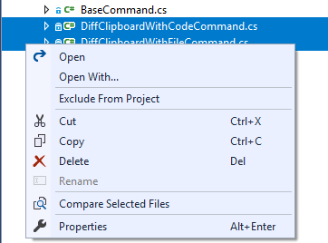
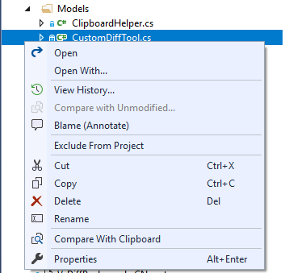
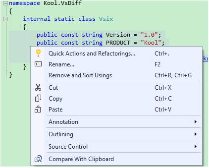
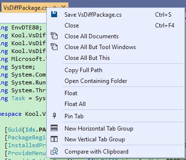
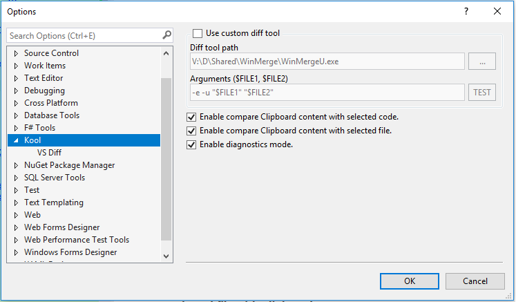

## About

 master (development)                                         | rel (release)                                                
 ------------------------------------------------------------ | ------------------------------------------------------------ 
  |  

Another open source Visual Studio extension that makes file/code comparison more easily.

You can download it via Visual Studio 2015/2017/2019 'Extensions and Updates' or [Marketplace](https://marketplace.visualstudio.com/items?itemName=heku.VsDiff).

## Features
- Compare two selected files in Solution Explorer.

    

- Compare the selected file with Clipboard content.

    

- Compare the selection code with Clipboard content.

    

- Compare the active document with Clipboard content.

    

## Configurable

## Thanks

Before and during my development, I took the following documents/projects for reference. Great thanks to the authors who did great job.

- [Clipboard Diff](https://github.com/einaregilsson/ClipboardDiff)
- [CodeMaid](https://github.com/codecadwallader/codemaid)
- [File Differ](https://github.com/madskristensen/FileDiffer)
- [Git Diff Margin](https://github.com/laurentkempe/GitDiffMargin)
- [Microsoft Docs](https://docs.microsoft.com/en-us/visualstudio/extensibility/)
- [VS.DiffAllFiles](https://github.com/deadlydog/VS.DiffAllFiles)

## License

- [MIT](LICENSE)