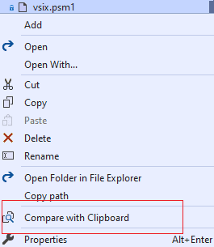

 

 

--------

Another open source Visual Studio extension that makes file/code comparison easier.

You can install it via Visual Studio 2015/2017/2019/2022 'Extensions' or download it from
- [Marketplace for VS2022](https://marketplace.visualstudio.com/items?itemName=heku.VsDiff2022).
- [Marketplace for VS2019 and below](https://marketplace.visualstudio.com/items?itemName=heku.VsDiff).

### Kind Reminder

This extension was developed because the [official one](https://github.com/madskristensen/FileDiffer) was missing many features I need at that time, and I also wanted to learn
how to write a Visual Studio extension. Since the official one has added almost all the missing features, I recommend everyone to give preference to that extension and use this
extension only when the official one does not work for you. Refer to blog [comparing files in visual studio](https://devblogs.microsoft.com/visualstudio/comparing-files-in-visual-studio).

## Features

- Compare two selected files in Solution Explorer.

    

- Compare the selected file with Clipboard content.

    

- Compare the selected code with Clipboard content.

    

- Compare the active document with Clipboard content.

    

## Configurable

## Thanks

Before and during my development, I referred the following projects and documents,
and I am very grateful to these authors who have done a great job.

- [Clipboard Diff](https://github.com/einaregilsson/ClipboardDiff)
- [CodeMaid](https://github.com/codecadwallader/codemaid)
- [File Differ](https://github.com/madskristensen/FileDiffer)
- [Git Diff Margin](https://github.com/laurentkempe/GitDiffMargin)
- [Microsoft Docs](https://docs.microsoft.com/en-us/visualstudio/extensibility/)
- [VS.DiffAllFiles](https://github.com/deadlydog/VS.DiffAllFiles)

## License

- [MIT](LICENSE)

---------

I'm not a native English speaker, and I would appreciate it if you could correct any of my English mistakes.