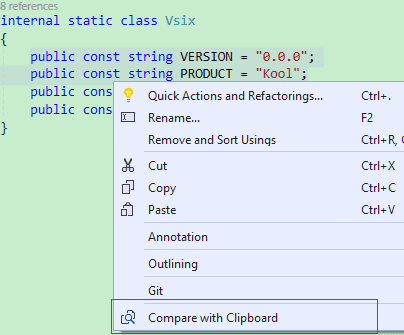
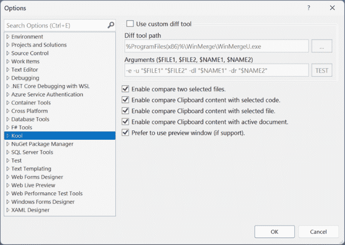

Another open source Visual Studio extension that makes file/code comparison easier.

- [VS 2022](https://marketplace.visualstudio.com/items?itemName=Heku.VsDiff2022)
- [VS 2015/2017/2019](https://marketplace.visualstudio.com/items?itemName=Heku.VsDiff)

### Kind Reminder

This extension was developed because the [official one](https://github.com/madskristensen/FileDiffer) was missing many features I need at that time, and I also wanted to learn
how to write a Visual Studio extension. Since the official one has added almost all the missing features, I recommend everyone to give preference to that extension and use this
extension only when the official one does not work for you. Refer to blog [comparing files in visual studio](https://devblogs.microsoft.com/visualstudio/comparing-files-in-visual-studio).

## Features

- Compare two selected files in Solution Explorer (Folder View supported).

    

- Compare the selected file with Clipboard content (Folder View supported).

    

- Compare the selected code with Clipboard content.

    

- Compare the active document with Clipboard content.

    

## Configurable

## Thanks

Thanks for every rating, I'm glad the tool is helpful to you,
because of a [network issue](https://github.com/heku/Kool.VsDiff/issues/5),
I may not be able to reply to you directly in the marketplace.

## Feedback

If you have any question, feel free to open an issue on [GitHub](https://github.com/heku/kool.vsdiff).