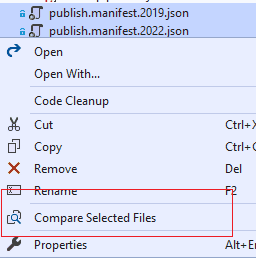

Another open source Visual Studio extension that makes file/code comparison more easily.

- [VS 2022](https://marketplace.visualstudio.com/items?itemName=Heku.VsDiff2022)
- [VS 2015/2017/2019](https://marketplace.visualstudio.com/items?itemName=Heku.VsDiff)

## Features

- Compare two selected files in Solution Explorer (Folder View supported).

    

- Compare the selected file with Clipboard content (Folder View supported).

    

- Compare the selection code with Clipboard content.

    

- Compare the active document with Clipboard content.

    

## Configurable

## Thanks

Thanks for every rating, I'm glad the tool is helpful to you,
because of a [network issue](https://github.com/heku/Kool.VsDiff/issues/5),
I cannot reply to you directly in the marketplace.

## Welcome

I'm not a native English speaker, so if you could correct any grammer mistake, it would be very appreciated.

## Feedback

If you have any question or problem, feel free to open an issue on [GitHub](https://github.com/heku/kool.vsdiff)